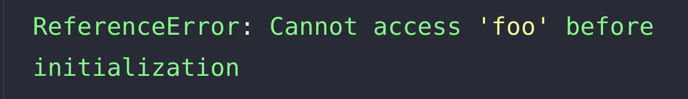

실행 컨텍스트를 이해하면 자바스크립트가 스코프를 기반으로 하여 식별자와 식별자에 바인딩 된 값을 관리하는 방식,
호이스팅의 발생 이유, 클로저의 동작방식, 그리고 테스크 큐와 동작하는 이벤트 핸들러와 비동기 처리의 동작 방식을 이해할 수 있다.
클로저를 지원하는 대부분의 언어는 유사한 개념이 적용되어 있다

## 실행 컨텍스트

- 소스 코드를 실행하는데 필요한 환경을 제공하고, 코드의 실행 결과를 실제로 관리하는 영역
- 식별자를 등록하고, 관리한느 스코프와 코드 실행 순서 관리를 구현한 내부 메커니즘 => 모든 코드는 실행 컨텍스트를 통해 실행되고 관리 됨
- 식별자와 스코프는 실행 컨텍스트의 **렉시컬 환경**으로 관리, 코드 실행순서는 **실행 컨텍스트 스택(콜스택)** 으로 관리

## 소스코드의 4가지 타입

1. 전역 코드
2. 함수 코드
3. eval 코드
4. 모듈 코드

- 위 4가지 방법으로 실행 컨텍스트를 구성할 수 있음
- 소스코드의 타입에 따라 실행 컨텍스트를 생성하는 과정과 관리 내용이 다름

### 전역코드

- 전역 코드는 전역 변수를 관리하기 위해 최상위 스코프인 전역 스코프를 생성해야 함.
- var 키워드로 선언된 전역 변수와 함수 선언문으로 정의된 전역 함수를 전역 객체의 프로퍼티와 메서드로 바인딩하고 참조하기 위해
  전역 객체로 연결되어야 함.
- 이를 위해 전역 코드가 평가되면 전역 실행 컨텍스트가 생성됨.

### 함수코드

- 함수 코드는 지역 스코프를 생성하고, 지역 변수, 매개변수, arguments 객체를 관리해야 함.
- 생성한 지역 스코프를 전역 스코프에서 시작하는 스코프 체인의 일원으로 연결해야 함.
- 이를 위해 함수 코드가 평가되면 함수 실행 컨텍스트가 생성됨.

### eval

- eval코드는 strict mode에서 자신만의 독자적인 스코프를 생성.
- 이를 위해 eval코드가 평가되면 eval 실행 컨텍스트가 생성

### 모듈 코드

- 모듈 코드는 모듈별로 독립적인 모듈 스코프를 생성
- 이를 위해 모듈 코드가 평가되면 모듈 실행 컨텍스트가 생성

## 소스 코드의 평가와 실행

- Javascript 엔진은 소스코드를 **평가**와 **실행**과정으로 나누어 처리

### 평가

실행 컨텍스틀르 생성하고 변수, 함수 등 선언문만 먼저 실행하여 생성된 변수나 함수등의 선언문만 먼저 실행하여
생성된 변수나 함수 식별자를 키로 실행 컨텍스트가 관리하는 스코프(렉시컬 환경의 환경 레코드)에 등록  
평가 과정에서 선언문만 먼저 실행하기 때문에 호이스팅이 발생함

### 실행

선언문을 제외한 소스코드를 실행하는 과정(런타임)  
소스코드 실행에 필요한 정보, 즉 변수나 함수의 참조를 실행 컨텍스트가 관리하는 스코프에서 검색해서 취득  
실행과정에서 일어나는 변수값의 변경 등은 다시 실행 컨텍스트가 관리하는 스코프에 등록됨

## 실행 컨텍스트의 역할

1. 선언에 의해 생성된 모든 식별자를 스코프를 구분하여 등록하고 상태변화를 지속적으로 관리
2. 스코프는 중첩 관계에 의해 스코프 체인을 형성. 즉, 스코프 체인을 통해 상위 스코프로 이동하며 식별자를 검색할 수 있어야 함
3. 현재 실행중인 코드의 실행순서를 변경하고 다시 원래 순서로 돌아 갈 수 있게 해줌(전역 코드를 실행하다가, 함수 호출을 만나면 함수코드를 실행 함수코드가 모두 실행되면 다시 전역코드로 돌아가기)

## 콜 스택(실행 컨텍스트 스택)

실행 컨텍스트가 하는 역할은 위와 같다.  
그렇다면 실행 컨텍스트의 실행순서는 어떻게 조정할까?  
실행 컨텍스트 실행 순서 조정은 자바스크립트 엔진의 콜스택(실행 컨텍스트 스택)에 의해서 결정된다.

스택은 LIFO(후입선출)의 특징을 가진 자료구조다.
자바스크립트 엔진은 콜스택에 실행 컨텍스트가 쌓이고, 이 스택의 최상위에 있는 실행 컨텍스트를 실행하는 식으로 동작한다.
따라서, 콜스택의 최상위에 위치 실행 컨텍스트를 실행중인 실행 컨텍스트(running execution context)라고 부른다.

<!-- 콜스택 이미지 -->

## 실행 컨텍스트의 구성요소

1. Variable Environment
2. Lexical Environment

### Variable Environment

- LexicalEnvironment에 담기는 값과 동일하지만, 최초 실행 시 스냅샷을 유지
- 실행 컨텍스트를 생성할 때 VariableEnvironment에 정보를 먼저 담고, 이를 복사해서 LexicalEnvironment를 만듬
- 그 후에는 주로 LexicalEnvironment를 사용

### Lexical Environment

- 식별자와 식별자에 바인딩 된 값, 상위 스코프에 대한 참조를 기록하는 자료구조
- 소스코드의 실행에 필요한 환경정보들이 LexicalEnvironment에 저장 됨
- key-value 형태의 스코프를 생성하여 식별자를 키로 등록하고 식별자에 바인딩 된 값을 관리

1. environmentRecord

   - 스코프에 포함된 식별자를 등록하고 식별자에 바인딩 된 값을 관리하는 저장소
   - 소스코드 타입에 따라 관리하는 내용의 차이가 있음

2. outerEnvironmentRecordReference

   - 상위 스코프에 대한 참조, 해당 실행컨텍스트를 생성한 실행 컨텍스트의 LexicalEnvironment를 가르킴,
   - 이 참조값을 이용해 단방향 링크드 리스트인 스코프 체인을 구현(하위스코프에서 상위스코프를 향하는 단방향으로만 구성되어 있음)

## Lexical Environment

소스코드에 따라서 Lexical Environment 내부의 environmentRecord에서 관리하는 내용에 차이가 있다고 했다.  
각 소스코드별로 어떻게 구성되어 있는지 알아보자.

### Global Lexical Environment

전역 렉시컬 환경을 생성할 때는 아래와 같은 과정이 발생한다.

1. 전역 실행 컨텍스트 생성
2. 전역 렉시컬 환경 생성
   1. Object Environment Record 생성
   2. Declarative Environment Record 생성
3. this binding
4. 외부 렉시컬 환경에 대한 참조 결정

[Global Lexical Environment]

| Global Lexical Environment          | Global Environment Record      | -                | -            |
| ----------------------------------- | ------------------------------ | ---------------- | ------------ |
| Global Environment Record           | Object Environment Record      | BindingObject => | globalObject |
| Outer Lexical Environment Reference | Declarative Environment Record |
| -                                   | [ [ GlobalThisValue ] ]        |

- Object Environment Record, Declarative Environment Record
- Object Environment Record는 var키워드로 선언한 변수, 함수 선언문으로 정의한 함수,
  빌트인 전역 프로퍼티, 빌트인 전역 함수, 표준 빌트인 객체를 관리함
- Declarative Environment Record는 let, const 키워드로 선언한 변수를 관리
- 이 두개가 협력해서 스코프, 전역 객체를 관리

1. Object Environment Record
   var 키워드로 선언된 전역변수 또는 함수 선언문으로 정의된 함수는 전역 환경 레코드의 객체 환경 레코드에 연결된
   BindingObject를 통해 전역 객체의 프로퍼티와 메서드가 된다.

2. Declarative Environment Record
   let, const로 선언한 전역변수는 선언적 환경 레코드에 등록되고 관리된다. let,const로 선언된 전역 변수는 전역 객체의 프로퍼티가 되지 않고
   개념적인 블록 내에 존재하게 되는데 그 개념적인 블록이 바로 이 Declarative Environment Record다.

3. This Binding
   전역 환경 레코드의 [[GlobalThisValue]] 내부 슬롯에 this가 바인딩된다. Global Lexical Environment에서 this는 전역 객체를 가리키므로
   전역 홚경 레코드의 [[GlobalThisValue]]는 전역 객체를 바인딩 된다.

### `var` vs `let, const`

- `var` 키워드로 선언된 변수들은 "선언"과 "초기화"가 동시에 일어난다. 즉, 코드 평가 시점에서 선언과 동시에 undefined를 바인딩한다.
- `let, const`키워드로 선언된 변수들은 "선언"과 "초기화"가 분리되서 일어난다.
  즉 평가단계에서 선언은 되지만 실행단계에서 변수 선언문에 도달했을 때 초기화 단계가 진행된다.
- `let, const`로 선언된 변수들 또한 평가단계에서 선언은 되지만, 초기화가 되기 전까지는 일시적 사각지대(Temporal Dead Zone)에 빠지게 된다.
- 일반적으로 `let, const`로 선언한 변수들은 실제 실행단계에서 선언이 되기 때문에 호이스팅이 발생안한다고 알고 있지만 사실 모든 변수는 호이스팅된다.
  다만, `let,const`로 선언된 변수들은 실제 런타임에 초기화가 되기 전까지는 접근할 수 없는 것 뿐이다.
- 그러면 이제 왜 에러메세지가 `ReferenceError: Cannot access 'foo' before initialization`이라고 표시되는지 이해할 수 있을 것이다.

  

### outerEnvironmentRecordReference

- 코드 실행에 필요한 정보들(식별자)를 검색할 때는 먼저 현재 실행중인 실행 컨텍스트에서 검색하기 시작한다.
- 만약 현재 실행중인 실행 컨텍스트에 해당하는 식별자가 없다면 outerEnvironmentRecordReference가 가리키고 있는 상위 스코프로 이동하여 식별자를 검색한다.
- 만약 최상위 스코프까지 올라갔는데 해당 식별자를 찾을 수 없다면 ReferenceError가 발생하게 된다.

### Function Lexical Environment

함수 렉시컬 환경을 생성할 때는 아래와 같은 과정이 발생한다.

1. 함수 실행 컨텍스트 생성
2. 함수 렉시컬 환경 생성
   1. Function Environment Record 생성
   2. this binding
   3. 외부 렉시컬 환경에 대한 참조 결정

| Function Lexical Environment       | Function Environment Record | Function Environment Record |
| ---------------------------------- | --------------------------- | --------------------------- |
| Function Environment Record        | Function Environment Record | parameter                   |
| outer Environment Record Reference | [ [ ThisValue ] ]           | arguments object            |
| -                                  | -                           | identifier                  |

함수 렉시컬 환경에서 중요한 점은 외부 렉시컬 환경에 대한 참조 결정은
해당 함수가 **평가**된 시점에 실행중인 실행 컨텍스트의 렉시컬 환경의 참조가 할당된다는 것이다.

함수의 정의는 코드 평가 시점에 평가된다. 따라서 평가될 시점에 실행중인 실행 컨텍스트가 바로 함수의 outer Environment Record Reference가 된다.

즉, 함수를 어디서 호출했는지가 아니라 어디에 정의했는지에 따라 외부 렉시컬 환경 참조가 결정된다. 좀 더 상세하게 설명하자면 자바스크립트 엔진은 함수 정의를 평가하여 함수 객체를 생성할 때
실행중인 실행 컨텍스트의 렉시컬 환경을 함수 객체의 내부 슬롯 [[Environment]]에 저장하고 함수의 outer Environment Record Reference에 할당되는 값은
함수 객체의 내부슬롯 [[Environment]]에 저장된 렉시컬 환경의 참조이다.

이러한 동작으로 인해서 **클로저**라는 개념이 성립되게 된다. 클로저는 외부 환경을 기억하고 있는 함수이다.

클로저를 이해하기 위해서는 실행 컨텍스트와 렉시컬 환경이 별개의 존재라는 것을 인식해야 한다.  
실행 컨텍스트는 해당 컨텍스트안의 모든 코드를 실행하고 나면 콜스택에서 제거되지만, 실행 컨텍스트가 제거된다고 반드시 렉시컬 환경이 제거되는 것은 아니다.
렉시컬 환경은 실행 컨텍스트에 의해서 참조되기는 하지만, 독립적인 개체로서 그 누구에게도 참조되지 않을 때 비로소 가비지 컬렉팅 대상이 되어서 메모리에서 소멸된다.
따라서 외부 함수의 실행 컨텍스트 내에서 정의된 내부함수가 외부 함수의 Lexical Environment를 계속해서 참조하고 있다면 외부 함수의 Lexical Environment는 소멸하지 않는다.

### BLOCK Lexical Environment

자바스크립트에서 var로 선언한 변수는 함수 블록 스코프만 적용이 되지만, ES6 이후로 등장한 let, const 키워드로 선언한 변수는
block level scope를 따른다.

따라서 별개의 공간을 가지기 위해서 블록 레벨 스코프를 생성해야 하므로 이를 위해 Declarative Environment Record를 가지는 Lexical Environment를 새롭게 생성한다.
그리고 이 때 생성된 BLOCK Lexical Environment가 가리키는 outerLexicalEnvironmentReference는 해당 코드블락이 실행되기 이전의 Lexical Environment를 가리킨다.

혼동하기 쉬운 부분은 코드 블락을 만나면 새로운 실행 컨텍스트를 생성하지는 않는다, 다만 현재 위치한 실행 컨텍스트 안에 새로운 BLOCK Lexical Environment를 생성하는 것 뿐이다.

## 정리

실행 컨텍스트는 소스 코드를 실행하는데 필요한 환경을 제공하고, 코드의 실행결과를 실제로 관리하는 영역입니다.  
이 실행 컨텍스트를 통해서 스코프, 클로저등의 동작과 코드의 실행 순서 관리가 구현됩니다.
실행 컨텍스트는 소스코드의 타입에 따라서 실행 컨텍스트를 생성하는 과정과 컨텍스트 내부에서 관리하는 내용이 달라집니다.

실행 컨텍스트 내부에서 렉시컬 환경이 생성되어서 컨텍스트 내부의 코드를 실행하는데 필요한 정보를 관리하고, 만약 코드의 실행단계에서 내부 렉시컬 환경에서 필요한 정보를 얻지 못한다면
해당 렉시컬 환경이 참조하고 있는 외부 렉시컬 환경을 타고 올라가면서 필요한 정보를 찾아냅니다.

또한, 실행 컨텍스트와 렉시컬 환경은 별도의 객체입니다. 실행 컨텍스트에서 렉시컬 환경을 참조하고는 있지만, 실행 컨텍스트가 종료된 후에도 해당 렉시컬 환경이 어딘가에서 참조되고 있다면
렉시컬 환경은 가비지 컬렉팅 대상에서 제외됩니다. 이러한 동작으로 인해 클로저라는 기능이 구현되고 있습니다.

또한 BLOCK Lexical Environment는 특별한 렉시컬 환경으로서 실행 컨텍스트를 생성하지는 않고, 단지 현재 실행되고 있는 컨텍스트 내에서 BLOCK Lexical Environment를 추가로 생성하는 식으로 동작하며 BLOCK Lexical Environment가
참조하고 있는 외부 Lexical Environment는 코드 블락이 실행되기 이전의 Lexical Environment를 가리킵니다.

클로저, 호이스팅, 실행 컨텍스트를 이해하고 사용하고 있다고 생각했지만, 추상적으로만 이해하고 있던 것이었고 내부적인 메커니즘에 대해서는 깊게 생각을 안하고 있었습니다.

개발 공부를 할 때 한가지 지식에 너무 깊게 몰두해서 빠지는 것은 지양해야 한다고 생각하지만, 이렇게 쓰면서도 몰랐던 내부 메커니즘에 대해서 학습하는 시간을 통해서 현재 내가 사용하고 있는 언어가 동작하고 있는지에 대해서 이해하는 시간을 가지는 것 또한
활용력과 넓은 시야를 길러주는 중요한 요소라고 생각이 됩니다.
